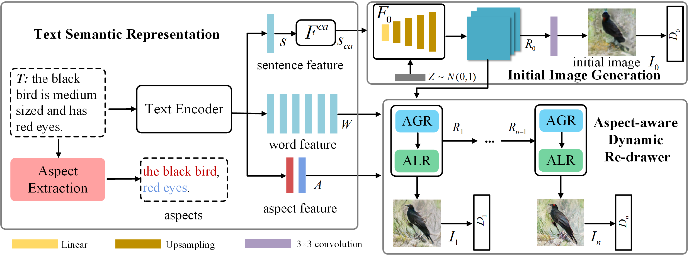
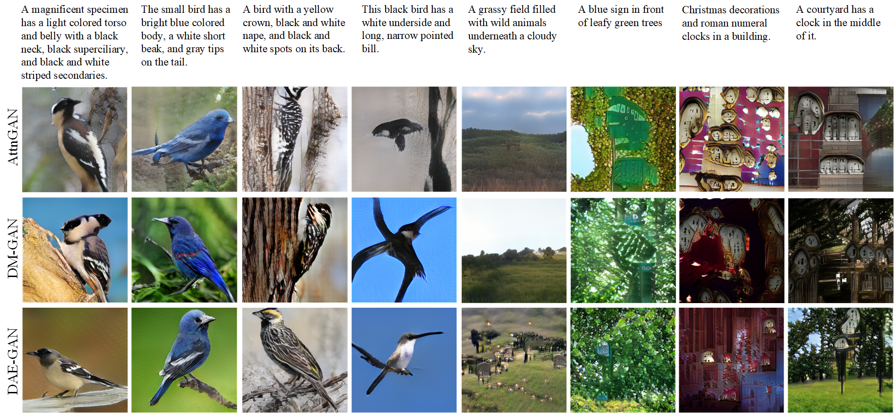

# DAE-GAN


Pytorch implementation for reproducing DAE-GAN results in the paper [DAE-GAN: Dynamic Aspect-aware GAN for Text-to-Image Synthesis] by Shulan Ruan, Yong Zhang, Kun Zhang, Yanbo Fan, Fan Tang, Qi Liu, Enhong Chen. (This work was performed when Ruan was an intern with Tencent AI Lab). 




### Dependencies
python 3.6

Pytorch

In addition, please add the project folder to PYTHONPATH and `pip install` the following packages:
- `python-dateutil`
- `easydict`
- `pandas`
- `torchfile`
- `nltk`
- `scikit-image`


**Data**

1. Download the [birds](http://www.vision.caltech.edu/visipedia/CUB-200-2011.html) image data. Extract them to `data/birds/`
2. Download [coco](http://cocodataset.org/#download) dataset and extract the images to `data/coco/`


**Training**
- Pre-train DAMSM models:
  - For bird dataset: `python pretrain_DAMSM.py --cfg cfg/DAMSM/bird.yml --gpu 0`
  - For coco dataset: `python pretrain_DAMSM.py --cfg cfg/DAMSM/coco.yml --gpu 0`
 
- Train DAE-GAN models:
  - For bird dataset: `python main.py --cfg cfg/bird_DAEGAN.yml --gpu 0`
  - For coco dataset: `python main.py --cfg cfg/coco_DAEGAN.yml --gpu 0`

- `*.yml` files are example configuration files for training/evaluation our models.


**Pretrained Model**
- [DAMSM for bird](https://drive.google.com/open?id=1GNUKjVeyWYBJ8hEU-yrfYQpDOkxEyP3V). Download and save it to `DAMSMencoders/`
- [DAMSM for coco](https://drive.google.com/open?id=1zIrXCE9F6yfbEJIbNP5-YrEe2pZcPSGJ). Download and save it to `DAMSMencoders/`
- [DAE-GAN for bird](https://pan.baidu.com/s/1kkh3V0az_H44fiUaPbt9gw). Download and save it to `models/` Passwd: 8ncq
- [DAE-GAN for coco](https://pan.baidu.com/s/15Ye7dKSMqItjXvvB5O2g4g). Download and save it to `models/` Passwd: jcg8


**Validation**
- To generate images for all captions in the validation dataset, change B_VALIDATION to True in the eval_*.yml. and then run `python main.py --cfg cfg/eval_coco.yml --gpu 1`
- We compute inception score for models trained on birds using [StackGAN-inception-model](https://github.com/hanzhanggit/StackGAN-inception-model).
- We compute inception score for models trained on coco using [improved-gan/inception_score](https://github.com/openai/improved-gan/tree/master/inception_score).


**Examples generated by DAE-GAN**

<!--  bird example              |  coco example
:-------------------------:|:-------------------------:
![] -->


**Citing DAE-GAN**

If you find DAE-GAN useful in your research, please consider citing:
```
@inproceedings{ruan2021dae,
  title={DAE-GAN: Dynamic Aspect-aware GAN for Text-to-Image Synthesis},
  author={Ruan, Shulan and Zhang, Yong and Zhang, Kun and Fan, Yanbo and Tang, Fan and Liu, Qi and Chen, Enhong},
  booktitle={Proceedings of the IEEE/CVF International Conference on Computer Vision},
  pages={13960--13969},
  year={2021}
}
```
<!-- 
```
@article{Tao18attngan,
  author    = {Tao Xu, Pengchuan Zhang, Qiuyuan Huang, Han Zhang, Zhe Gan, Xiaolei Huang, Xiaodong He},
  title     = {AttnGAN: Fine-Grained Text to Image Generation with Attentional Generative Adversarial Networks},
  Year = {2018},
  booktitle = {{CVPR}}
}
``` -->

**Reference**

- [StackGAN++: Realistic Image Synthesis with Stacked Generative Adversarial Networks](https://arxiv.org/abs/1710.10916) [[code]](https://github.com/hanzhanggit/StackGAN-v2)
- [Unsupervised Representation Learning with Deep Convolutional Generative Adversarial Networks](https://arxiv.org/abs/1511.06434) [[code]](https://github.com/carpedm20/DCGAN-tensorflow)
- [AttnGAN: Fine-Grained Text to Image Generation with Attentional Generative Adversarial Networks](https://openaccess.thecvf.com/content_cvpr_2018/papers/Xu_AttnGAN_Fine-Grained_Text_CVPR_2018_paper.pdf) [[code]](https://github.com/taoxugit/AttnGAN)
- [DM-GAN: Dynamic Memory Generative Adversarial Networks for Text-to-Image Synthesis](https://openaccess.thecvf.com/content_CVPR_2019/papers/Zhu_DM-GAN_Dynamic_Memory_Generative_Adversarial_Networks_for_Text-To-Image_Synthesis_CVPR_2019_paper.pdf) [[code]](https://github.com/MinfengZhu/DM-GAN)
